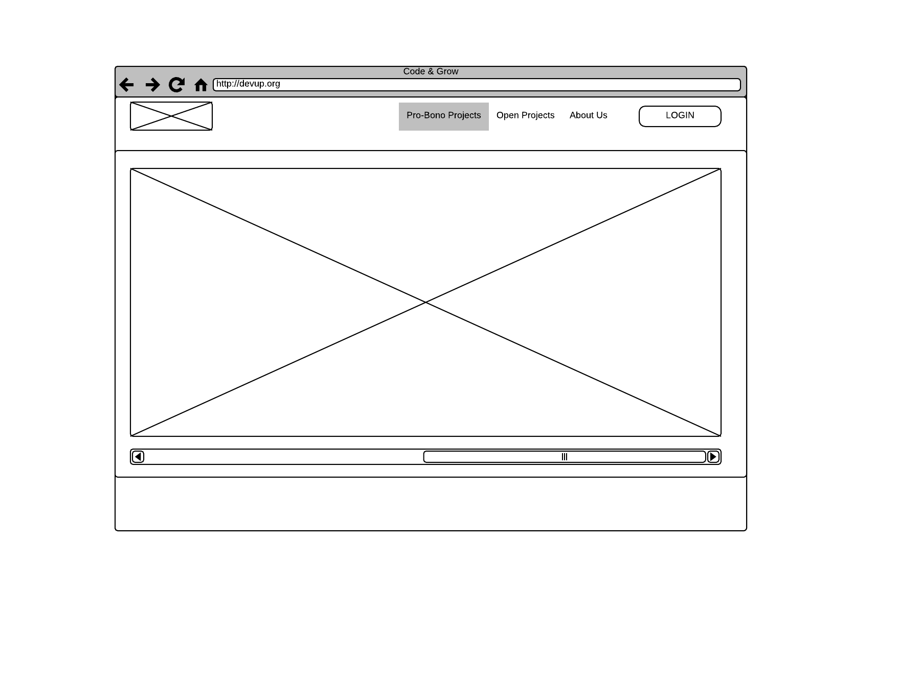
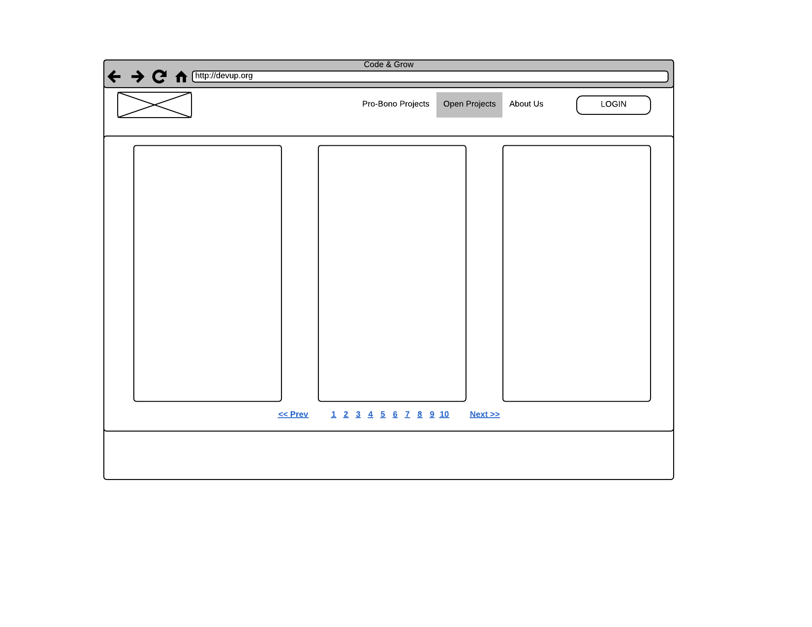
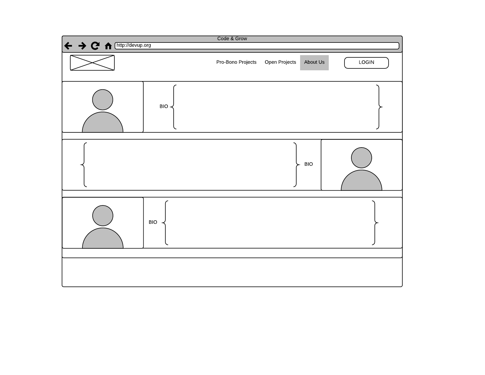
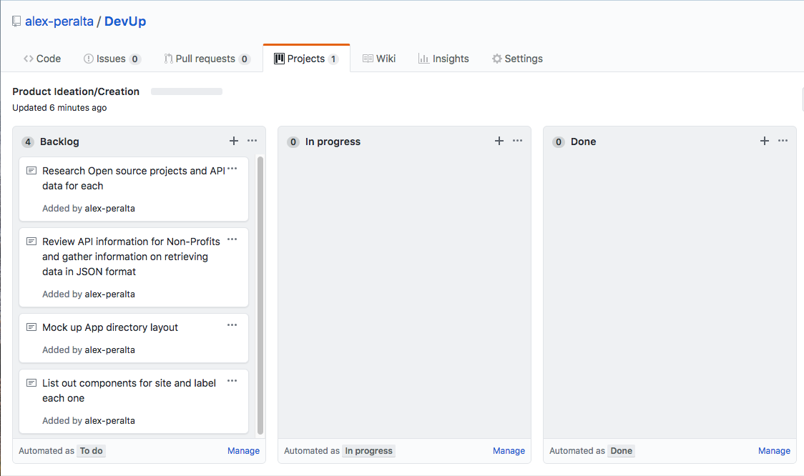

# Why "DevUp"?
There are many Non-Profit organizations who are in need 
of some level of application Development support, but don't have the resources to hire or 
support their own staff of Software Engineers. Many of these companies use Pro-Bono opportunities 
as a means to solicit Software experts to accomplish their IT needs. The DevUp application bridges 
the gap between aspiring Developers looking for opportunities to level-up (or, DevUp) their skills, 
and companies offering Pro-Bono opportunities, and open source projects, which developers can use 
to improve their professional portfolios. These opportunities can serve as great experience and an 
opportunity for recent College and Bootcamp grads to solve real business problems while growing their
professional portfolios. 

# The Team
* Alexander Peralta - UX Engineer / Product Manager
* Nelly Ackerman - System Engineer
* Denis Gayvoronsky - Database Engineer 

# Design Layout
##### Landing Page / Pro-Bono Projects Page

##### Open Projects Page

##### About Us Page


# Project Plan

##### Kanban Board

##### High Level Plan
```
Sprint 0: Design Sprint to evolve idea and create backlog, produce first Mockups.
Sprint 1: Groom backlog, research APIs required, design and deliver first iteration of backend systems (Node.js / MongoDB). Develop UI and finalize design.
Sprint 2: Identify bugs, dev issues and iterate through them. Begin preparation for presentation. Test product extensively.
Sprint 3: Finalize Testing and Presentation. Final walk through with team.
```


